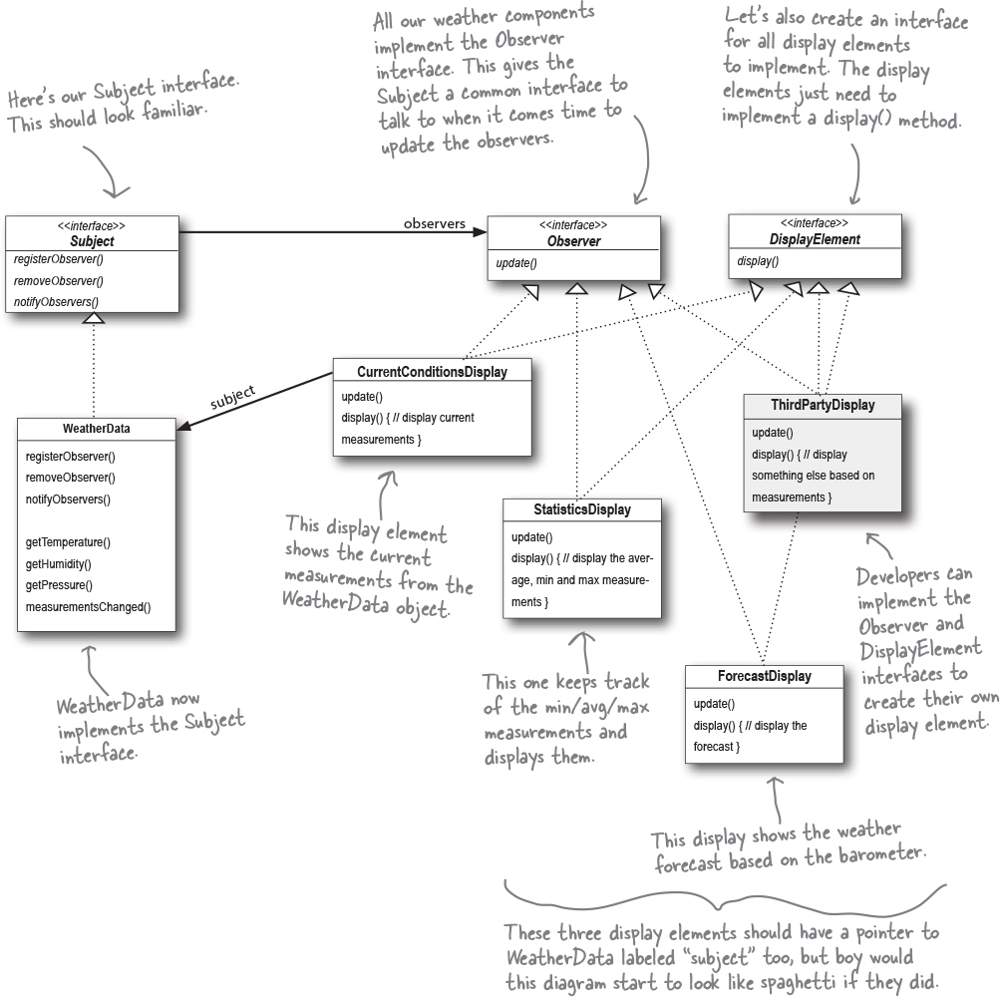

## Category: Comportemennt
## Definition : 
Le modèle d'observateur définit une dépendance
un-à-plusieurs entre les objets de sorte que 
lorsqu'un objet change d'état, toutes ses 
dépendances sont notifiées et mises à jour automatiquement.

##Notre objectif

Nous savons que nous devons implémenter un affichage, puis que la mise à jour WeatherData s'affiche à chaque fois qu'elle a de nouvelles valeurs, ou, en d'autres termes, à chaque fois que la méthode MeasurementChanged() est appelée. Mais comment? Réfléchissons à ce que nous essayons de réaliser :

Nous savons que la classe WeatherData a des méthodes getter pour trois valeurs de mesure : température, humidité et pression barométrique.

Nous savons que la méthodemeasuresChanged() est appelée à chaque fois que de nouvelles données de mesure météorologique sont disponibles. (Encore une fois, nous ne savons pas ou ne nous soucions pas de la façon dont cette méthode est appelée ; nous savons simplement qu'elle est appelée. )

Nous devrons implémenter trois éléments d'affichage qui utilisent les données météorologiques : un affichage des conditions actuelles , un affichage des statistiques et un affichage des prévisions . Ces affichages doivent être mis à jour aussi souvent que les WeatherData ont de nouvelles mesures.

Pour mettre à jour les affichages, nous allons ajouter du code à la méthodemeasuresChanged().